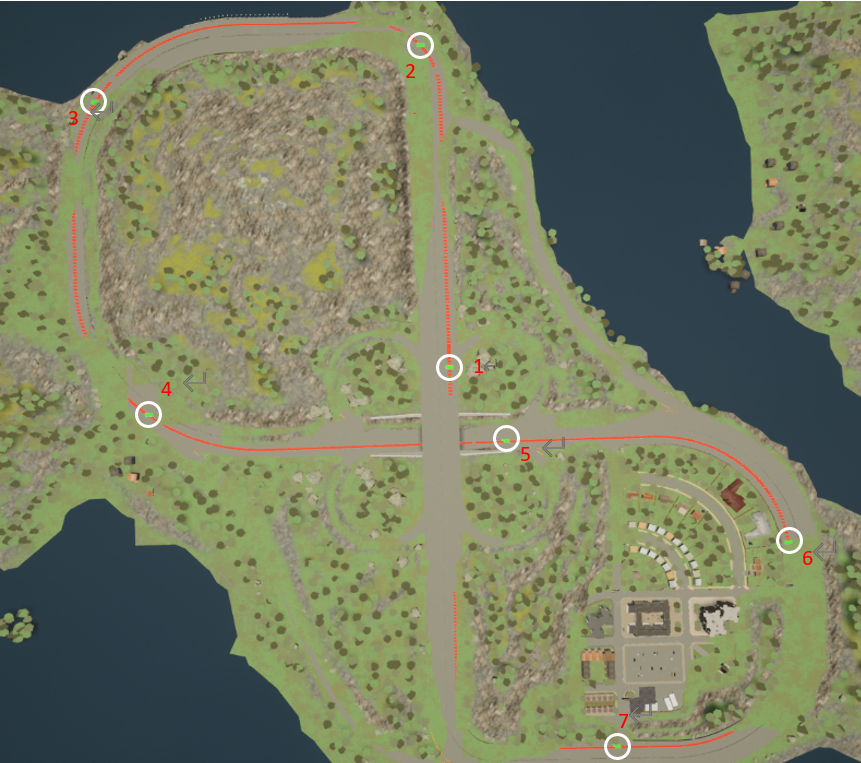
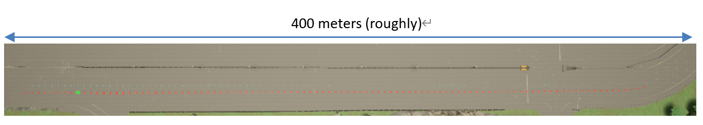
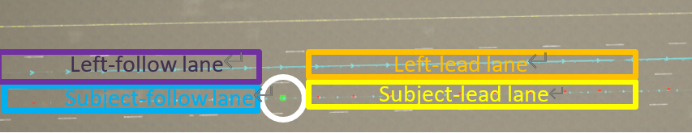

# Freeway Backend Core Concepts

This page introduces the main features and modules in freeway backend. Reading this page will give you an idea of how the freeway backend is working.

Here is a skeleton image showing the relationship between different components involved in the backend. The introduction below is in the order from top to bottom.

	 - freeway simulation environment
	       \   
		  - Init Section
		  |        \ 
		  |         - section reference point
		  |                       \
		  |                           - ego vehicle
		  |        \
		  |         - subject-lead lane
		  |                       \
		  |                           - subject lead vehicle 1, subject lead vehicle 2
		  | 
		  |         - left-lead lane
		  |                       \
		  |                           - left lead vehicle 1, left lead vehicle 2
		  | 
		  |         - subject-follow lane
		  |                       \
		  |                           - subject follow vehicle 1
		  | 
		  |         - left-follow lane
		  |                       \
		  |                           - left follow vehicle 1
		  | 
		  |
		  - Normal Intersection 1
		  |        \
		  |         command to vehicles
		  | 
		  - Normal Intersection 2
		  |        \
		  |         command to vehicles
		  | 
		  - Normal Intersection 3
		  |        \
		  |         command to vehicles
		  | 

## Freeway simulation environment

The freeway simulation environment consists of a series of connected **Sections** (user can custom number of Sections, currently support at most 7 sections), as shown in the image below. All vehicles in the freeway simulation environment are full-path vehicles, and will navigate from the first intersection to the end.

> The 7-section freeway simulation scenario created in [Town04](https://carla.readthedocs.io/en/latest/core_map/) provided by CARLA simulator. The added vehicles are going to navigate from section 1 to section 7. 

## Section and Init Section

### Section
**Section** is the major component for simulation scenario creation. Each section consists of 2 major parts: a **departure area** for (roughly) 60 meters , used to add vehicles (in init section) or apply section based vehicle control commands (normal section), and a long lane for vehicles to execute commands applied to them.

A typical **Section** is **defined by** the following parameters:

- localization parameters

       - world location: the (x,y) location of the center of **Departure area of Section** with respect to the CARLA MAP. This point is refered to as "section_reference_point"

       - section length: the total length of the section, or the distance between one "section_reference_point" to the next one. The default is 400 meter, currently users are not allowed to change this value.

Each section contains **2** lanes, the "subject lane" and "left lane", as shown in the figure below. 

 

> A demo of a full section. The green rectangle inside the image is the "section_reference_point" of this section. All the red points in the image represent the "subject lane", the cyan points represent the "left lane". (The cyan point is a little bit light, try zoom the page to 140% to see those points). The section length is roughly 400 meters, which is set by the back end and cannot be changed by users.

### Init Section
**Init Section** is the first section inside the freeway environment (e.g. the section with number 1 in the [big picture](freeway_backend_introduction.md#freeway-simulation-environment) above). This section is currently the only section that allows adding vehicles. Vehicles are added to the **Departure area of the Init Section**, which is divided into 5 parts: section reference point, subject-lead lane, left-lead lane, subject-follow lane and left-follow lane, as shown in the figure below.

> The 5 parts that consists of the departure area of the initial section. 
  
  - The green rectangle circled out is the "section_reference_point". The ego vehicle will be applied at this point. 

  - Vehicles are added based on the vehicle_type (i.e. lead vehicle / follow vehicle) and lane choice (i.e. left / subject). For example, a lead vehicle choosing left lane will be added in the left-lead lane.

### Normal Section(s)
**Normal Sections** are sections after the init section (e.g. the section with number 2-7 in the [big picture](freeway_backend_introduction.md#freeway-simulation-environment) above). 

