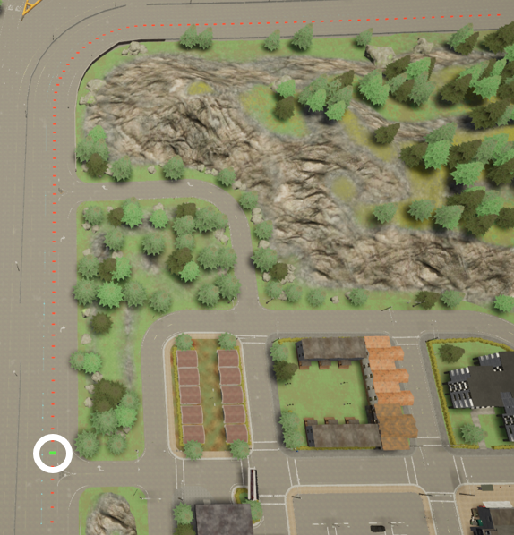

# Freeway Backend Core Concepts

This page introduces the main features and modules in freeway backend. Reading this page will give you an idea of how the freeway backend is working.

Here is a skeleton image showing the relationship between different components involved in the backend. 

	 - freeway simulation environment
	       \   
		  - Init Section
		  |        \ 
		  |         - section reference point
		  |                       \
		  |                           - ego vehicle
		  |        \
		  |         - subject-lead lane
		  |                       \
		  |                           - subject lead vehicle 1, subject lead vehicle 2
		  | 
		  |         - left-lead lane
		  |                       \
		  |                           - left lead vehicle 1, left lead vehicle 2
		  | 
		  |         - subject-follow lane
		  |                       \
		  |                           - subject follow vehicle 1
		  | 
		  |         - left-follow lane
		  |                       \
		  |                           - left follow vehicle 1
		  | 
		  |
		  - Normal Intersection 1
		  |        \
		  |         command to vehicles
		  | 
		  - Normal Intersection 2
		  |        \
		  |         command to vehicles
		  | 
		  - Normal Intersection 3
		  |        \
		  |         command to vehicles
		  | 

## Freeway simulation environment

### Introduction
The freeway simulation environment consists of a series of connected **Sections** (user can custom number of Sections, currently support at most **7** sections), as shown in the image below. 

> The 7-section freeway simulation scenario created in [Town04](https://carla.readthedocs.io/en/latest/core_map/) provided by CARLA simulator. 

### Create a simulation environment

To create a freeway environment, users only need to specify the number of sections they need. The back end will automatically generate corresponding **Init Section** and **Sections** according to that command. For example, if user wants a 7-section environment, then an environment mimic the figure above will be created.

### Init section

Init Section is the first section inside the environment. Currently, this is the only section that allow users to add vehicles, and these vehicles will be available until simulation ends. The init section consists of two parts: departure area and navigation lane, as shown in the figure below.

> The init section. The left-blue area is the departure area, the right-red area is the navigation lane.

> The departure area consists of 5 parts: a section reference point (the green rectangle circled out by a white circle) and 4 lanes named after the rule "lane_choice-vehicle_type". This area is used to add vehicles, which will be discussed later.

> The navigation lane consists of 2 lanes: subject lane and left lane. The lane in the figure with red points is the subject lane, the other one is the left lane.

Vehicles will be added in the departure area and then navigate to the right into the navigation lane. The bahavior of vehicles will be discussed in detail in the Vehicle section below.

### Normal section

Normal sections are sections after the init section. A normal section consists of a section reference point and a navigation lane, as shown in the picture below.

When a vehicle navigates into a new normal section, the section will apply a user specified command to that vehicle. The bahavior of the vehicles will be discussed in detail in the Vehicle section below.

## Vehicle

### Vehicle types

The back end currently supports 3 types of vehicles:

|Type|Introduction|Number limit|vehicle_type|
|---|---|---|---|
|Ego|the subject vehicle of the simulation|Only one allowed in a simulation|"ego"|
|Lead|vehicles in front of the ego vehicle when being added to simulation|/|"lead"|
|Follow|vehicles after the ego vehicle when being added to simulation|/|"follow"|

All these vehicles are full-path vehicle, will go from the init section to the last section.

Note: there is no guarantee that lead vehicle will always be in front of the ego vehicle, and there is no guarantee that follow vehicle will always be after ego.

> Image showing the relative positioning of the ego, lead and follow vehicles when being added.

### Add vehicles

As stated in the [init section](freeway_backend_introduction.md#init-section) part, the init section is the only section that allow users to add vehicles. To be more precise, vehicles are added to the departure area of the init section.

> The departure area consists of 5 parts: a section reference point (the green rectangle circled out by a white circle) and 4 lanes named after the rule "lane_choice-vehicle_type".

- ego vehicle: the ego vehicle is added to the "section reference point", at the center of the departure area. 

- lead vehicle: lead vehicles are added to the 2 lanes with the keyword "lead". User need to specify the lane (left / subject) to add the lead vehicle. For example, if user choose to add a lead vehicle to the left lane, then a vehicle will be added to the "Left-lead" lane. 

- follow vehicle: follow vehicles are added to the 2 lanes with the keyword "follow". User need to specify the lane (left / subject) to add the follow vehicle. For example, if user choose to add a follow vehicle to the subject lane, then a vehicle will be added to the "Subject-follow" lane.

> a demo of how vehicles are addeds

### Section Based vehicle commands

As stated in the [normal section](freeway_backend_introduction.md#normal-section) part, normal sections are going to apply control to each vehicle. The back end currently supports three kinds of different navigation commands:

|Command|Introduction|Vehicles to apply|Note|
|---|---|---|---|
|speed|keep vehicle navigating under constant speed|Ego, Lead, Follow|/|
|lane|change lane at user specified time|Lead, Follow|may change vehicle settings relative positioning, i.e. follow vehicle in front of ego / lead vehicle after ego|
|distance|keep distance between a vehicle and the ego vehicle|Lead, Follow|*|

*
Vehicle with "distance" command may abandon the command if any of the following conditions is met: 

- Follow vehicle in front of ego / Lead vehicle after ego

- There exists at least one vehicle between the vehicle with "distance" command and the ego vehicle

> demo of the "lane" command in first person view

> demo of the "lane" command in top view

> demo of the "distance" command in first person view

> demo of the "distance" command from top

For the init section, the section based vehicle commands are applied to each vehicle once the simulation starts. **For normal sections, the commands are applied to each vehicle when the ego vehicle is close enough to the section reference point.**

---
author: shijiliu

date: 2020-07-26

email: shijiliu@umich.edu

---
