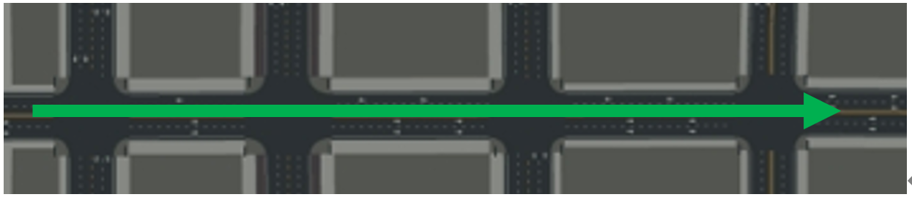
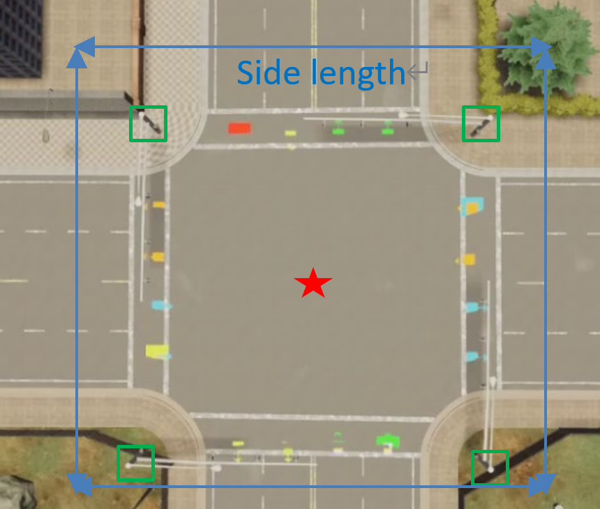
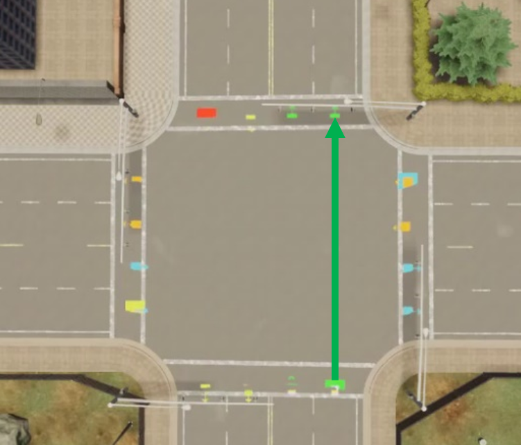
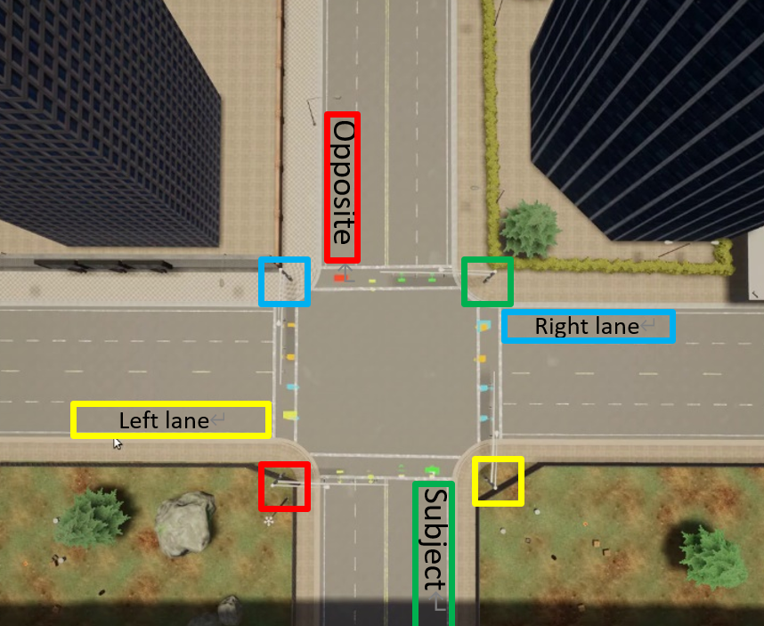
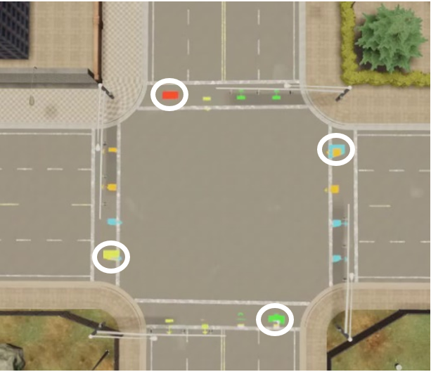
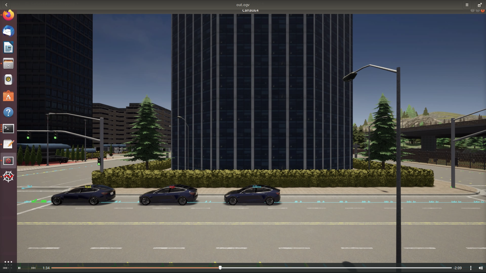

# Urban Backend Core Concepts

This page introduces the main features and modules in urban backend. Reading this page will give you an idea of how the urban backend is working.

Here is a skeleton image showing the relationship between different components involved in the backend. The introduction below is in the order from top to bottom.

	 - urban simulation environment
	       \   
		  - Init Intersection
		  |        \
		  |         - subject lane
		  |                       \
		  |                           - lead vehicle, ego vehicle, follow vehicle
		  | 
		  |         - left lane
		  |                       \
		  |                           - normal vehicle 1, normal vehicle 2, normal vehicle 3
		  | 
		  |         - right lane
		  |                       \
		  |                           - normal vehicle 1
		  | 
		  |         - opposite lane
		  |                       \
		  |                           - normal vehicle 1
		  | 
		  |         - subject light
		  |         - left light
		  |         - right light
		  |         - opposite light
		  |
		  - Normal Intersection 1
		  | 
		  | 
		  | 
		  - Normal Intersection 2
		  | 
		  | 
		  | 
		  | 
		  - Normal Intersection 3

## Urban simulation environment

The urban simulation environment consists of a series of **Intersections** (user can custom number of intersections), as shown in the image below. An **ego vehicle** will go in the direction of the green arrow through each intersection. 

> The 4-intersection urban simulation scenario created inside [Town05](https://carla.readthedocs.io/en/latest/core_map/) provided by CARLA simulator.  

## Intersection

**Intersection** is the major component for simulation scenario creation. A typical **Intersection** is **defined by** the following parameters:

- localization parameters

       - world location: the (x,y) location of the center of **Intersection** with respect to the CARLA MAP. The center is determined by the average of the 4 traffic lights on the corner of the intersection (green box in the picture below).

       - Side length: determine the coverage of an intersection   

> To locate an intersection, we need 2 parameters: world location and side length

- direction parameter

    - yaw: yaw angle used to determine the direction the ego vehicle will go through the intersection

> yaw can be transform into a direction vector, as shown in the picture

With the help of intersection location and direction parameters, we can split the lanes and traffic lights inside the intersection into 4 parts: subject, left, right, opposite, as shown in the following picture

## Lane

Lanes are represented by a lane_reference_point, which is of carla.Waypoint type, which has a (x,y,z) location and a lane direction. The typical choice of the 4 reference points is shown in the figure below.

> picture showing the lane representation

Vehicles are added into intersections by choosing a specific lane. The later a vehicle is added to a specific lane, the farther it's position is from the center of intersection. The way vehicles are added to the intersection is shown in the gif below.

> gif showing the process of adding vehicles into lane.

## Vehicle

Backend supports 2 different type of vehicles: 

- Intersection-only vehicle   
    The intersection only vehicle, or "other type" vehicle, is a kind of vehicle that's only going to navigate inside a specific intersection. Following options are currently supported for these vehicles:

    - Turning option: 
       turn left; go straight; turn right
    
    - Obey traffic light option:
       obey; ignore

    - Stop option when stop at red light:      

      normal stop (stop at the border line);    

      abrupt stop (stop once light detected);    
 

      penetrate border line;   

       

    - gap: the distance between this vehicle and the vehicle in front of it when being added to a lane
     - safety distance: the smallest distance between this vehicle and the vehicle in front of it when navigating

    
    > vehicles avoid collision by holding safety distance 

- Full-path vehicle   
    The full path vehicle is the vehicle that go through different intersections. Basic settings for full path vehicles are identical to the Intersection-only vehicle, except the turning option for full-path vehicle is fixed to be straight.
   
    Three types of full path vehicles are available: 

    - ego vehicle   
    Each simulation must include an ego vehicle, which will go through all intersections in the simulation.

    - lead vehicle   
    The lead vehicle is the vehicle in front of the ego vehicle. When adding a lead vehicle, there must exist one and only one ego vehicle in the intersection. The lead vehicle is going to wait for the ego vehicle is the ego vehicle is blocked by the traffic light. As is shown in the gif below.
    

    
    > the lead vehicle wait for the ego vehicle

    - follow vehicle
    Follow vehicle is the vehicle behind ego vehicle. When adding a follow vehicle, there must exist one and only one ego vehicle in the intersection.
    
## Init Intersection and Normal Intersection

The init intersection is the intersection for adding the full path vehicles (ego,lead,follow). These vehicles will be added to the subject lane of the init intersection. Once simulation is started, the vehicles added into the init intersection will start moving.

The normal intersections are intersections after the initial one. All vehicles added to these intersections are intersection-only vehicles. Simulation inside these intersection will not start until a full-path vehicle enter the intersection.  

## Traffic light

Traffic lights are split into subject, left, right and opposite light. User can have access to the traffic lights and customize the light color timeline.

## Import and Export

Import and export for intersection settings are supported by the backend. 

For normal intersection, following settings will be imported/exported:

- vehicles inside each lane (all vehicle settings will be reserved)
- traffic light color timeline for each light

For init intersection, the vehicles inside the subject lane will not be imported/exported, since this lane is intended to adding full path vehicles. Other settings will be imported/exported as for normal intersection.

